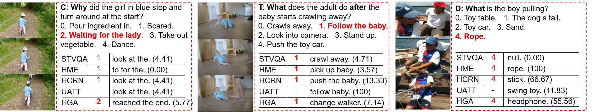

# [NExT-QA](https://arxiv.org/pdf/2105.08276.pdf) 

We reproduce some SOTA VideoQA methods to provide benchmark results for our NExT-QA dataset accepted to CVPR2021. NExT-QA is a VideoQA benchmark targeting the explanation of video contents. It challenges QA models to reason about the causal and temporal actions and understand the rich object interactions in daily activities. We set up both multi-choice and open-ended QA tasks on the dataset. <strong>This repo. provides resources for multi-choice QA</strong>; open-ended QA is found in [NExT-OE](https://github.com/doc-doc/NExT-OE). For more details, please refer to our [dataset](https://doc-doc.github.io/docs/nextqa.html) page.

## Todo
1. [x] [Relation annotations](https://drive.google.com/file/d/1RW8ck39n-yScGrOZWJ7gBr1jH3Iy4SSl/view?usp=sharing) are available.
2. [x] <s>Open evaluation server</s> and release [test data](https://drive.google.com/file/d/1_MEqDeQHc8Y8Uw7eW58HVuZy2iyThILQ/view?usp=sharing).
3. [x] Release [spatial feature](https://drive.google.com/file/d/1yJ30T1oAjJ8cO3nHQID0EmIm-yQHdYkK/view?usp=sharing) (valid for 2 weeks).
4. [x] Release [RoI feature](https://drive.google.com/file/d/1vU9IEW0GvXz3wzumfu9X8lm4ri2SBjLB/view?usp=sharing)(tensor shape (clip_per_video, frame_per_clip, region_per_frame, feat_dim). See [HQGA](https://github.com/doc-doc/HQGA) on how to use).
5. [ ] Release BERT finetune code for VQA.

## Environment

Anaconda 4.8.4, python 3.6.8, pytorch 1.6 and cuda 10.2. For other libs, please refer to the file requirements.txt.

## Install
Please create an env for this project using anaconda (should install [anaconda](https://docs.anaconda.com/anaconda/install/linux/) first)
```
>conda create -n videoqa python==3.6.8
>conda activate videoqa
>git clone https://github.com/doc-doc/NExT-QA.git
>pip install -r requirements.txt #may take some time to install
```
## Data Preparation
Please download the pre-computed features and QA annotations from [here](https://drive.google.com/drive/folders/1gKRR2es8-gRTyP25CvrrVtV6aN5UxttF?usp=sharing). There are 4 zip files: 
- ```['vid_feat.zip']```: Appearance and motion feature for video representation. (With code provided by [HCRN](https://github.com/thaolmk54/hcrn-videoqa)).
- ```['qas_bert.zip']```: Finetuned BERT feature for QA-pair representation. (Based on [pytorch-pretrained-BERT](https://github.com/LuoweiZhou/pytorch-pretrained-BERT/)).
- ```['nextqa.zip']```: Annotations of QAs and GloVe Embeddings. 
- ```['models.zip']```: HGA model. 

After downloading the data, please create a folder ```['data/feats']``` at the same directory as ```['NExT-QA']```, then unzip the video and QA features into it. You will have directories like ```['data/feats/vid_feat/', 'data/feats/qas_bert/' and 'NExT-QA/']``` in your workspace. Please unzip the files in ```['nextqa.zip']``` into ```['NExT-QA/dataset/nextqa']``` and ```['models.zip']``` into ```['NExT-QA/models/']```. 

*(You are also encouraged to design your own pre-computed video features. In that case, please download the raw videos from [VidOR](https://xdshang.github.io/docs/vidor.html)+[missing videos](https://drive.google.com/file/d/12WCsaOOlDQNaXILSxvL-hIM3TxV15dV3/view?usp=sharing). As NExT-QA's videos are sourced from VidOR, you can easily link the QA annotations with the corresponding videos according to the key 'video' in the ```['nextqa/.csv']``` files, during which you may need the map file ```['nextqa/map_vid_vidorID.json']```)*.


## Usage
Once the data is ready, you can easily run the code. First, to test the environment and code, we provide the prediction and model of the SOTA approach (i.e., HGA) on NExT-QA. 
You can get the results reported in the paper by running: 
```
>python eval_mc.py
```
The command above will load the prediction file under ['results/'] and evaluate it. 
You can also obtain the prediction by running: 
```
>./main.sh 0 val #Test the model with GPU id 0
```
The command above will load the model under ['models/'] and generate the prediction file.
If you want to train the model, please run
```
>./main.sh 0 train # Train the model with GPU id 0
```
It will train the model and save to ['models']. (*The results may be slightly different depending on the environments*)
## Results on Val. Set
| Methods                  | Text Rep. | Acc_C | Acc_T | Acc_D | Acc | Text Rep. | Acc_C | Acc_T | Acc_D | Acc   |
| -------------------------| --------: | ----: | ----: | ----: | ---:| --------: | ----: | ----: | ----: | ----: |
| BlindQA                  |   GloVe   | 26.89 | 30.83 | 32.60 | 30.60 | BERT-FT | 42.62 | 45.53 | 43.89 | 43.76 |
| [EVQA](https://github.com/doc-doc/NExT-QA/blob/main/networks/VQAModel/EVQA.py)                     |   GloVe   | 28.69 | 31.27 | 41.44 | 31.51 | BERT-FT | 42.64 | 46.34 | 45.82 | 44.24 |
| [STVQA](https://github.com/doc-doc/NExT-QA/blob/main/networks/VQAModel/STVQA.py) ([CVPR17](https://openaccess.thecvf.com/content_cvpr_2017/papers/Jang_TGIF-QA_Toward_Spatio-Temporal_CVPR_2017_paper.pdf))  |   GloVe   | 36.25 | 36.29 | 55.21 | 39.21 | BERT-FT | 44.76 | 49.26 | 55.86 | 47.94 |
| [CoMem](https://github.com/doc-doc/NExT-QA/blob/main/networks/VQAModel/CoMem.py) ([CVPR18](https://openaccess.thecvf.com/content_cvpr_2018/CameraReady/1924.pdf))  |   GloVe   | 35.10 | 37.28 | 50.45 | 38.19 | BERT-FT | 45.22 | 49.07 | 55.34 | 48.04 |
| [HME](https://github.com/doc-doc/NExT-QA/blob/main/networks/VQAModel/HME.py) ([CVPR19](https://openaccess.thecvf.com/content_CVPR_2019/papers/Fan_Heterogeneous_Memory_Enhanced_Multimodal_Attention_Model_for_Video_Question_Answering_CVPR_2019_paper.pdf))    |   GloVe   | 37.97 | 36.91 | 51.87 | 39.79 | BERT-FT | 46.18 | 48.20 | 58.30 | 48.72 |
| [HCRN](https://github.com/thaolmk54/hcrn-videoqa) ([CVPR20](https://openaccess.thecvf.com/content_CVPR_2020/papers/Le_Hierarchical_Conditional_Relation_Networks_for_Video_Question_Answering_CVPR_2020_paper.pdf))   |   GloVe   | **39.09** | **40.01** | 49.16 | **40.95** | [BERT-FT](https://github.com/doc-doc/HCRN-BERT) | 45.91 | 49.26 | 53.67 | 48.20 |
| [HGA](https://github.com/doc-doc/NExT-QA/blob/main/networks/VQAModel/HGA.py) ([AAAI20](https://ojs.aaai.org//index.php/AAAI/article/view/6767))   |   GloVe   | 35.71 | 38.40 | **55.60** | 39.67 | BERT-FT | **46.26** | **50.74** | **59.33** | **49.74** |
| **Human**                |    -      | **87.61** | **88.56** | **90.40** | **88.38** |  -  | **87.61** | **88.56** | **90.40** | **88.38** |

(For comparison, please refer to the results on val/test sets in our paper.)
## Multi-choice QA *vs.* Open-ended QA

## Citation
```
@InProceedings{xiao2021next,
    author    = {Xiao, Junbin and Shang, Xindi and Yao, Angela and Chua, Tat-Seng},
    title     = {NExT-QA: Next Phase of Question-Answering to Explaining Temporal Actions},
    booktitle = {Proceedings of the IEEE/CVF Conference on Computer Vision and Pattern Recognition (CVPR)},
    month     = {June},
    year      = {2021},
    pages     = {9777-9786}
}
```
## Acknowledgement
Our reproduction of the methods is based on the respective official repositories, we thank the authors to release their code. If you use the related part, please cite the corresponding paper commented in the code.
