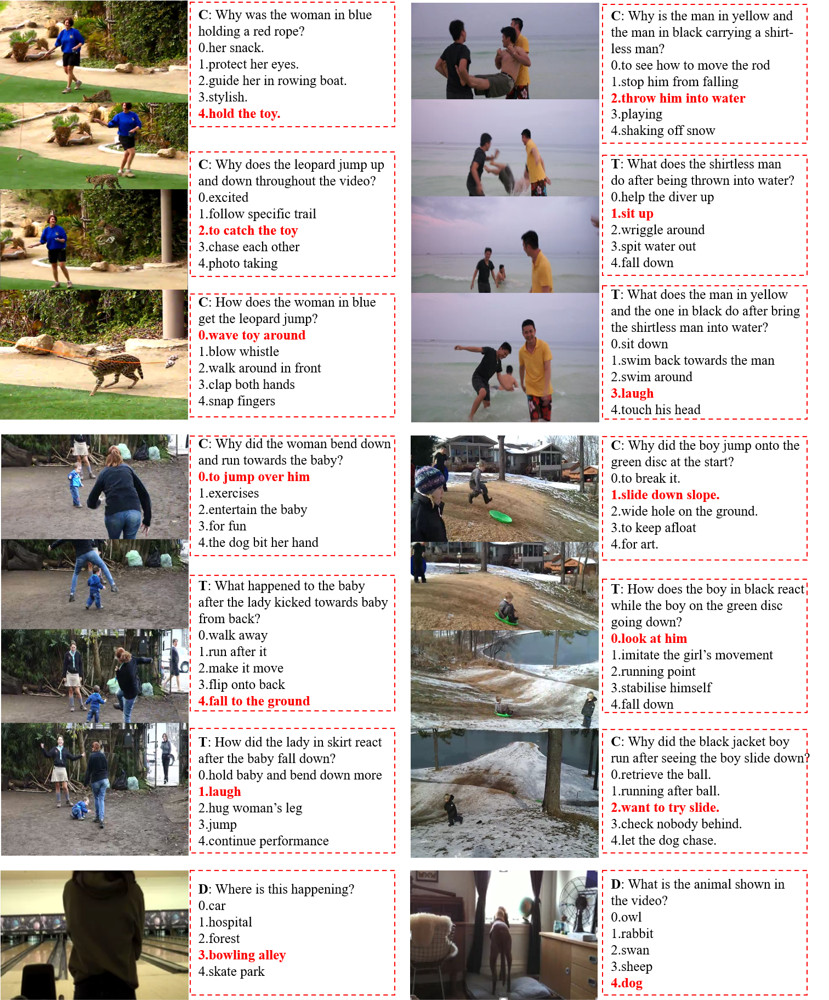

# NExT-QA: Next Phase of Question-Answering to Explaining Temporal Actions

We reproduce some SOTA VideoQA methods to provide benchmark results for our NExT-QA dataset published on CVPR2021 (with 1 Strong Accept and 2 Weak Accepts). 

NExT-QA is a VideoQA benchmark to advance video understanding from describing to explaining the temporal actions. It is unique in that it goes beyond descriptive QA (what is) to benchmark causal and temporal action reasoning (why/how did) in realistice videos and it is also rich in object interactions. NExT-QA contains 5440 videos and over 52K manually annotated question-answer pairs grouped into causal, temporal and descriptive questions. We set up both multi-choice and open-ended QA tasks on the dataset. This repo. provides resources for multi-choice QA. Open-ended QA is found in [NExT-OE](https://github.com/doc-doc/NExT-OE).

## Environment

Anaconda 3, python 3.6.8, pytorch 1.6 and cuda 10.2. For others libs, please refer to the file requirements.txt.

## Install
Please create an envs for this project using anaconda3 (should install [anaconda](https://docs.anaconda.com/anaconda/install/linux/) first)
```
>conda create -n vqa python=3.6.8 # Create env
>conda activate vqa # Enter
>git clone https://github.com/doc-doc/NExT-QA.git # download
>pip install -r requirements.txt # Install the provided libs #cd NExT-QA and install libs
```
## Data Preparation
Please download the pre-computed features and QA annotations from [here](https://drive.google.com/drive/folders/1gKRR2es8-gRTyP25CvrrVtV6aN5UxttF?usp=sharing). There are three zip files correspond to 1) appearance and motion feature for video representation, 2) finetuned BERT feature for QA-pair representation, and 3) annotations of QAs and GloVe Embeddings. After downloading the data, please create a folder ['data'] at the same directory as NExT-QA (this repo), then unzip the video and QA features into it. You will have directories like ['data/vid_feat/*' and 'data/qas_bert/*']. Please unzip the file 'nextqa.zip' into ['NExT-QA/dataset/nextqa']. 

You are also encouraged to design your own pre-computed video features. In that case, please download the raw videos from [VidOR](https://xdshang.github.io/docs/vidor.html). As NExT-QA's videos are sourced from VidOR, you can easily link the QA annotations with the corresponding videos according to the key 'video' in the [nextqa/*.csv] files, during which you may need the map file ['nextqa/map_vid_vidorID.json'].


## Usage
Once the data is ready, you can easily run the code. First, to test the environment and code, we provide the prediction and model of the SOTA approach (i.e., HGA) on NExT-QA. 
You can get the results reported in the paper by running: 
```
>python mul_eval.py
```
The command above will load the prediction file under ['results/'] and evaluate it. 
You can also obtain the prediction by running: 
```
>./main.sh 0 val #Test the model with GPU id 0
```
The command above will load the model under ['models/'] and generate the prediction file.
If you want to train the model, please run
```
>./main.sh 0 train # Train the model with GPU id 0
```
It will train the model and save to ['models']
## Visualization
|Query| bicycle-jump_beneath-person       | person-feed-elephant          | person-stand_above-bicycle       | dog-watch-turtle|
|:---| --------------------------------- | ----------------------------- | ---------------------------------------- | ---------------------------------------- | 
|Result|  |    | ||
|Query| person-ride-horse       | person-ride-bicycle          |   person-drive-car     |  bicycle-move_toward-car|
|Result|  |    | ||
## Multi-choice Examples

## Citation
```
@inproceedings{xiao2021nextqa,
  title={NExT-QA: Next Phase of Question-Answering to Explaining Temporal Actions},
  author={Xiao, Junbin and Shang, Xindi and Angela Yao and Chua, Tat-Seng},
  booktitle={Computer Vision and Pattern Recognition (CVPR)},
  year={2021},
  organization={IEEE}
}
```
## Acknowledgement
Our reproduction of the methods are based on the respective official code repositories, we thanks the authors to release their code. If you use the related code, please cite the corresponding paper which we have commented in the code.
